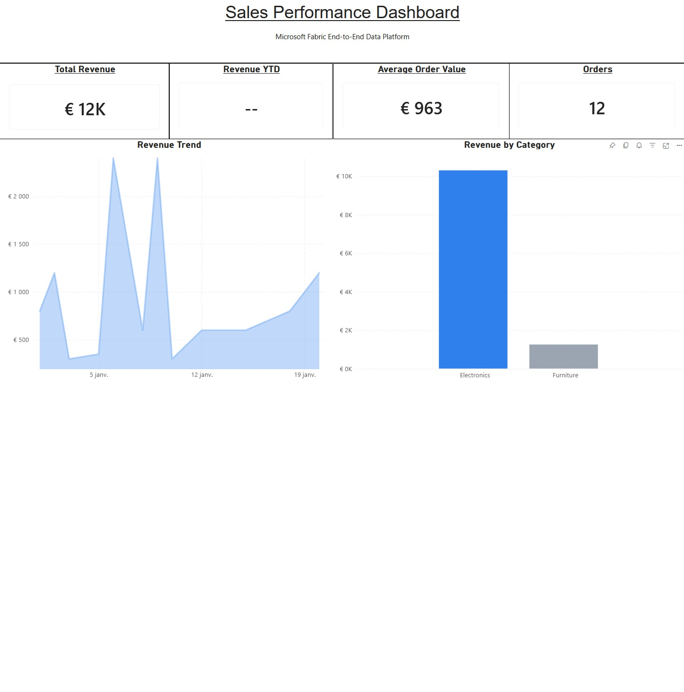
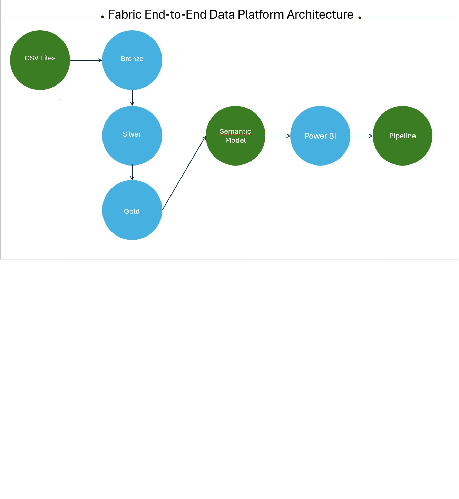
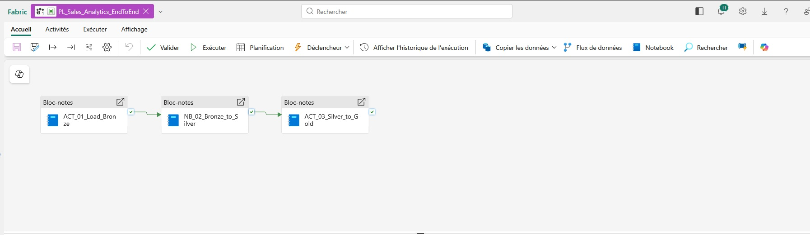
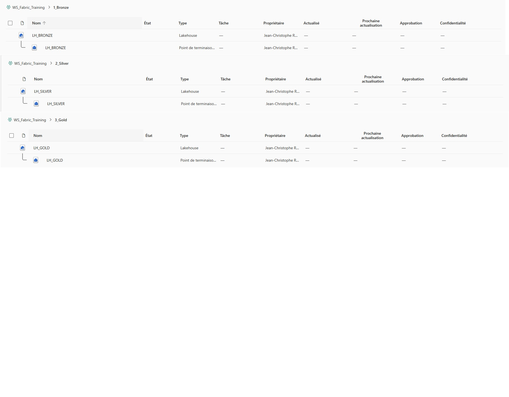
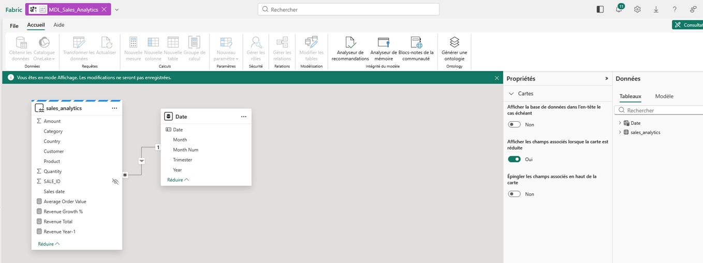

# 🚀 Microsoft Fabric End-to-End Data Platform

## 📊 Sales Analytics Example

This project demonstrates how to build a complete modern data platform using Microsoft Fabric.

It covers the full lifecycle of data:
- Ingestion
- Transformation
- Modeling
- Visualization

---

## 🏗️ Architecture

The solution follows a **Medallion Architecture**:

- 🟤 **Bronze** → Raw data ingestion  
- ⚪ **Silver** → Data transformation  
- 🟡 **Gold** → Analytics-ready data  

---

## 🔄 Data Pipeline

A Fabric pipeline orchestrates the full process:

1. Data ingestion into Bronze  
2. Transformation into Silver  
3. Aggregation into Gold  
4. Refresh of semantic model  

---

## 🗄️ Lakehouse Structure

The Lakehouse is structured into three layers:

- `LH_BRONZE`
- `LH_SILVER`
- `LH_GOLD`

---

## 🧠 Semantic Model

The semantic model exposes business metrics such as:

- Total Revenue  
- Revenue YTD  
- Average Order Value  
- Number of Orders  

---

## 📈 Power BI Dashboard

The dashboard provides:

- Revenue trend analysis  
- Category breakdown  
- Key performance indicators (KPIs)  

---

## 🛠️ Technologies Used

- Microsoft Fabric  
- Lakehouse architecture  
- Medallion design pattern  
- PySpark (Notebooks)  
- Fabric Pipelines  
- Power BI  

---

## 🎯 Project Goal

The goal of this project is to provide a **simple and complete example** of a Microsoft Fabric data platform.

It can be used for:
- Learning Microsoft Fabric  
- Demonstrating data engineering skills  
- Building a starter kit for real-world projects  

---

## ⭐ If you found this useful

If this project helps you, feel free to give it a ⭐ on GitHub!
